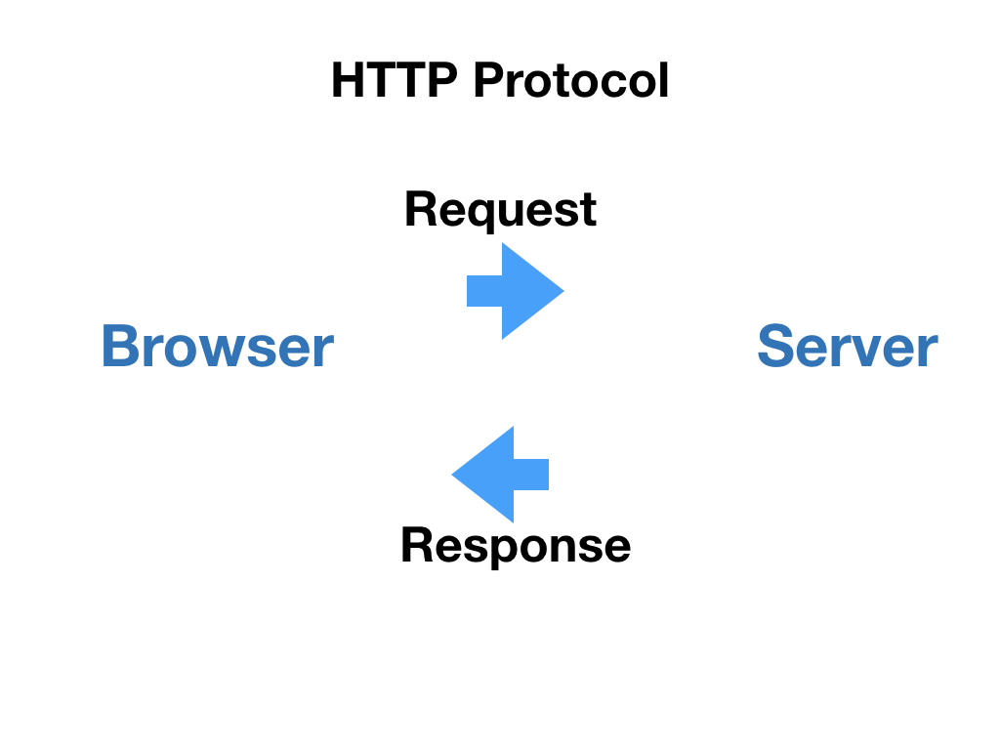

# HTTP プロトコルと AJAX

## HTTP プロトコルとは

クライアント\(例えば Chrome 等のウェブブラウザ\)とサーバーが、World Wide Web（ウェブ）の世界で通信するためのプロトコル = 規約です。



## いつどのように使われているか

* ブラウザのアドレスバーに入力 -&gt; HTTP Request -&gt; Server 
* a タグのリンクをクリックする -&gt; HTTP Request -&gt; Server

## 通常のブラウザからの HTTP Request をした場合には、ブラウザを更新してしまう

通常のブラウザからの HTTP Request をした場合にはブラウザを更新してしまいます。こうすると、せっかく React の App が様々な状態を持っていても、ページを遷移する際に情報を失ってしまってリセットされてしまいます。また、ブラウザからの通常の HTTP 通信は、同期通信なので、レスポンスがあるまで待たなくてはいけません。

## そこで AJAX / XMLHttpRequest object を使用した HTTP 通信

AJAX 二つの技術の組み合わせのことです。簡潔に言えば、「JavaScript でサーバーと非同期な通信をおこない、それによって得たデータを JavaScript で DOM に反映させることで、ユーザーに表示する手法」です。

* ブラウザに組み込まれた XMLHttpRequest object\(XHRO\) を用いたサーバーとの非同期な HTTP 通信
* 受け取ったデータを用いて JavaScript で HTML DOM を変更する

### ポイントは…

* JavaScript から HTTP リクエストを出す
* 通信が非同期である
* 画面が遷移しない
* それに伴ってURLも変わらない

## Axios というライブラリを使って AJAX 通信をする

[https://codesandbox.io/s/pp64z70v9m](https://codesandbox.io/s/pp64z70v9m)

```javascript
const url = "https://developer.mozilla.org/en-US/docs/Web/HTML";

axios.get(url).then(res => {
  console.log(res.data);
  document.body.innerHTML = res.data;
});
```

